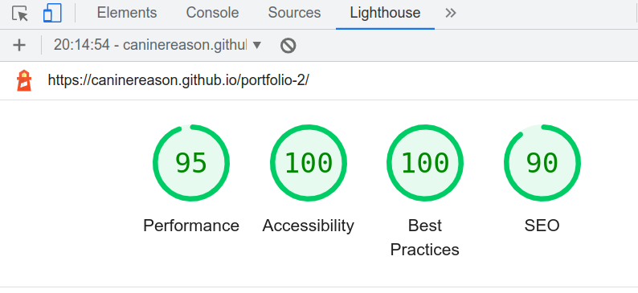

# Minesweeper

- Live link - https://caninereason.github.io/portfolio-2/

# Overview
- For this javascript project I chose to recreate the classic windows game 'Minesweeper', using html, css and javascript. This is a quick puzzle game, which many people may have played on old windows operating systems.The game requires the player to hunt for mines on a grid, while giving them limited information on where the bombs are located. Once the player clicks on the grid the squares are revealed, and they are shown how many potential bombs lie in the neighbouring squares. The player must use this information to deduce where the bombs are placed, and flag them accordingly. If all the bombs have been flagged then the player wins the game, however should the player click on a bomb, all the bombs explode and the game is over.

## Features

- __Main menu__

  - The game is quite minimal in design, with only a single pop-up modal with which the player can interact and choose difficulty levels. On the initial load of the page this modal explains the rules for the game.

- __Interaction__

  - These rules can be shown or hidden by clicking on the guide button, or while in game they can be accessed by clicking on the face at the top of the game board, pausing the game timer and stopping the user from interacting with the board. The modal can be closed with the x button in the top left corner, however if the player has received a game over or a win condition, this x will change to a message informing the player to pick a level. This was a design choice to limit the user from being stuck in a finished game and not knowing where to click to reactivate the modal.

 

 - __Level Select__

   - The player also has three difficulty options, easy a 10 x 10 board with 10 bombs, medium a 12 x 12 board with 25 bombs, and hard a 15 x 15 board with 50 bombs. Once the player clicks a difficulty level, the modal closes, the timer starts and the game begins. The game may be paused again by clicking the face at the top of the game board. The player can left click on the board to reveal the squares, or right click on the board to place a flag on a square.

- __Flags__

   - the number on the top left of the board represents how many flags the player has left, while also representing how many bombs are left to find. Should the player run out of flags and they have not found all the bombs, they must figure out where they have placed a false flag in order to win the game.

- __Timer__

   - The timer will count every second that has passed in the game, unless the game has been paused. Should the timer reach 999 the bombs will explode and the game is over.

- __Footer__

   - The footer section contains links to relevant social media networks, opening the default website in a new window.

## Testing

   - The game has been tested on multiple browsers and devices, and appears to work flawlessly on desktop devices. The game plays quite well on mobile phones, only requiring the user to long press on the board to place a flag.

### Validation

- HTML
  - No errors were returned when passing through the official [W3C validator](https://validator.w3.org/nu/?doc=https%3A%2F%2Fcaninereason.github.io%2Fportfolio-2)
- CSS
  - No errors were found when passing through the official [(Jigsaw) validator](https://jigsaw.w3.org/css-validator/validator?uri=https%3A%2F%2Fcaninereason.github.io%2Fportfolio-2%2Fassets%2Fcss%2Fstyle.css&profile=css3svg&usermedium=all&warning=1&vextwarning=&lang=en)

- JS
  - Passed jshint tests with zero errors.

### Bugs

  - after much testing on many browsers and devices, I found some bugs on smaller devices. When the screen width was too small, the larger grids would be obscured by the edge of the screen. I fixed this with a media query, checking the devices width, and removing the medium or hard option should the screen not support it.
  - There was also a bug on devices with a higher dpr setting, which would order the squares in the wrong way, resulting in the game behaving in strange ways. I fixed this by checking the device pixel ratio in a media query and limiting the level options accordingly. I had to make many commits here to debug on smaller devices.

## Deployment

- The site was deployed to GitHub pages. The steps to deploy are as follows: 
  - In the GitHub repository, navigate to the Settings tab 
  - on the left is a menu, find pages and open it
  - under Branch it will say "GitHub Pages is currently disabled. Select a source below to enable GitHub Pages for this repository"
  - From the source section drop-down menu, select the main branch
  - Once the main branch has been selected, press the save button to the right
  - Now the message under branch should read "Your GitHub Pages site is currently being built from the main branch." 

## Credits  

  - Background and title images are personal creations
  - emoji's, bombs and flags were taken from the default installed windows 10 emoji pack
  - For the modal I modified an example from w3schools.com https://www.w3schools.com/howto/tryit.asp?filename=tryhow_css_modal
  - For the timer I modified this codepen by Srikar G. https://codepen.io/srikarg/pen/kKVJVa
  - For the random bomb placement I used this shufflearray function from codegrepper https://www.codegrepper.com/code-examples/javascript/math+random+sort

